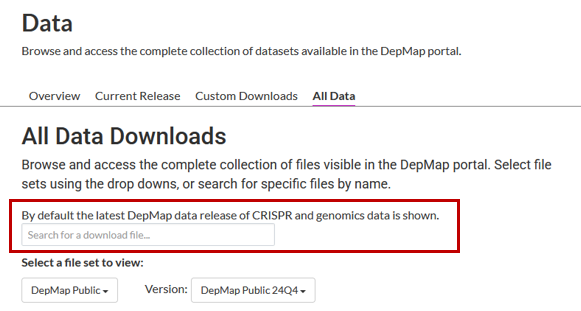
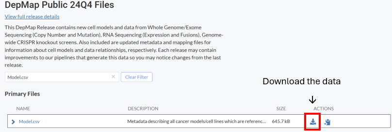
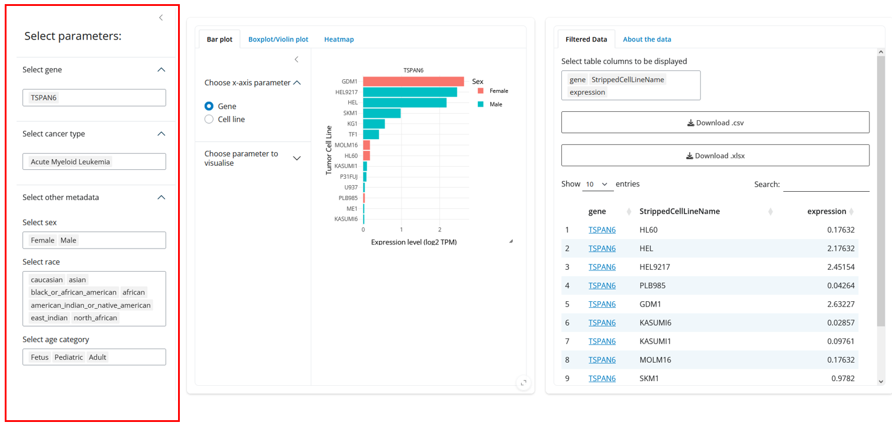
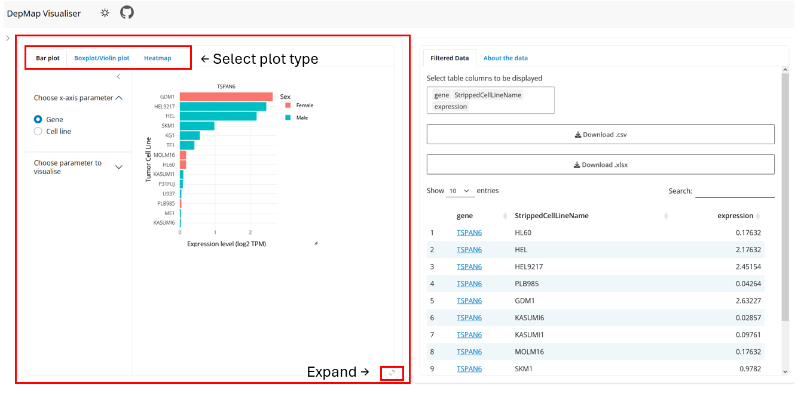
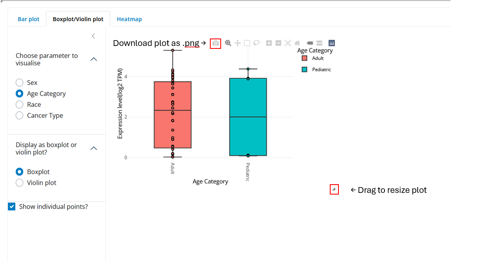
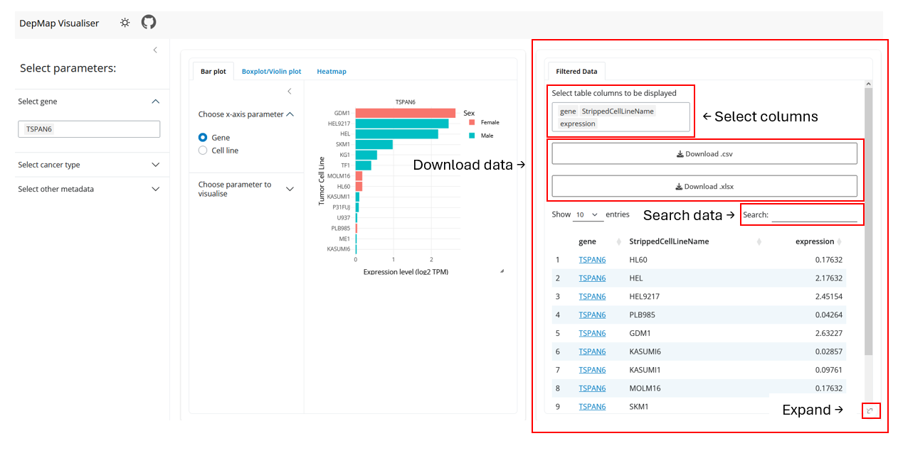
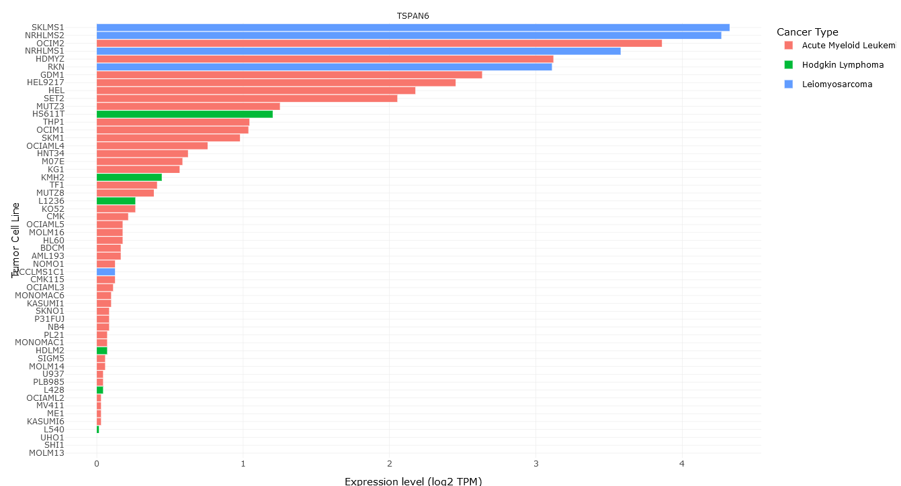
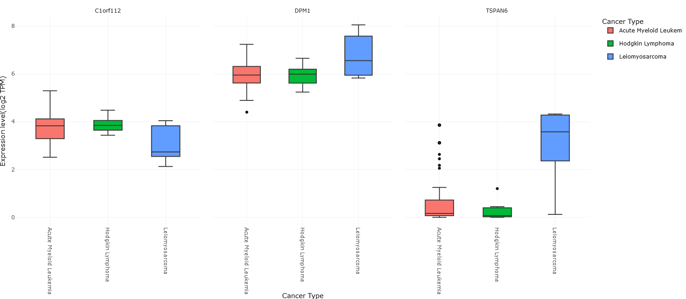
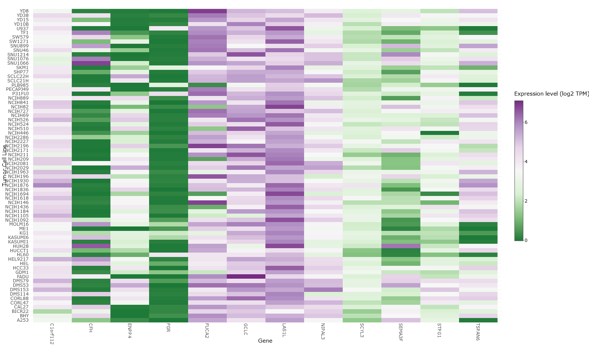

# DepMap Visualiser (V. 0.1)

## Authors: 

- Yamila Timmer ([https://github.com/YamilaTimmer](https://github.com/YamilaTimmer))

## Description

The [Dependency Map](https://depmap.org/portal/) (DepMap) portal offers large batches of open-access cancer research data, in order to support new scientific discoveries within the field. The goal is tp map the 'landscape' of cancer vulnerabilities, through different approaches:

- Capturing genetic and molecular diversity of human cancer, by gathering more than 2000 different models
- Identifying genes that are required for cell growth and drug sensitivities
- Creating a map of cancer vulnerabilities
- Identifying genetic and molecular alterations in cancer cells

If you would like to learn more about these running DepMap projects, I highly recommend you visit [their website](https://depmap.org/portal/home/#/our-approach). This data dashboard focusses mainly on the first and last pointer. It is able to compare metadata, cell lines, genes and gene expression. While visualising large amounts of data has proven to be difficult, DepMap Visualiser is a tool that allows users to visualise DepMap data in various ways, including barplots, boxplots, violin plots and heatmaps. Users can do all of this while filtering on specific metadata to include/exclude the data, as the user wishes. For more background information or for more information on how to interpret the plots generated in this application, please see [# How to interpret the data](README.md#how-to-interpret-the-data).

### Key-features
- Visualise large batches of DepMap data,
- Allows selecting different metadata parameters, to fine-tune data,
- Generating plots with the data, including bar plots, boxplots, violinplots and heatmaps,
- Generating sortable tables with the filtered data,
- The ability to save the generated visuals (.png) and the table data (.csv/.xlsx),
- User-friendly dashboard interface.

## System requirements and installation

### System requirements

- OS: Linux
- R: 4.0 or higher

### Installing tools
Download the following DepMap datasets from [https://depmap.org/portal/data_page/?tab=allData](https://depmap.org/portal/data_page/?tab=allData):

- `OmicsExpressionProteinCodingGenesTPMLogp1`
- `Model.csv`

Navigate to the top of the page and enter the two dataset names in the search bar.






**Clone the repository**

```bash

git clone git@github.com:YamilaTimmer/depmap-portal-data-visualizations.git

```

**Install the required R packages**

```r
install.packages(c(
  "shiny", 
  "plotly", 
  "writexl", 
  "shinycssloaders", 
  "RColorBrewer", 
  "shinyjs", 
  "DT", 
  "shinyBS", 
  "bslib", 
  "shinyjqui", 
  "ggplot2",
  "yaml",
  "tidyr"
))
```

### Version details
The application is made using R version [4.4.2](https://cran.r-project.org/bin/windows/base/) (Pile of Leaves) and the following R packages are integrated into DepMap Visualiser, have been used in the development or have been used for the [Explorative Data Analysis (EDA)](https://github.com/YamilaTimmer/depmap-portal-data-visualizations/blob/main/doc/EDA.rmd):

| Package Name        | Description                                                 | Version   |
|---------------------|-------------------------------------------------------------|-----------|
| [Shiny](https://github.com/rstudio/shiny) | Package that allows creating interactive R applications |1.9.1|
| [plotly](https://github.com/plotly/plotly.R)| Package that allows creating interactive graphs |4.10.4|
| [writexl](https://github.com/ropensci/writexl) | For converting dataframe to excel (.xslx)-format |1.5.1|
| [shinycssloaders](https://github.com/daattali/shinycssloaders)| Used for adding loading icons in application |1.1.0|
| [RColorBrewer](https://github.com/cran/RColorBrewer)| Used for adding color palettes to heat map  |1.1.3|
| [DT](https://github.com/rstudio/DT)| Used for interactive datatable output in application |0.33|
| [bslib](https://github.com/rstudio/bslib/) | Used for layout/structuring of application  |0.8.0|
| [shinyjqui](https://github.com/Yang-Tang/shinyjqui)| Used for making plots resizable |0.4.1|
| [ggplot2](https://github.com/tidyverse/ggplot2)| Used for making all plots (bar plot, boxplot, violin plot, heatmap)|3.5.1|
| [naniar](https://github.com/njtierney/naniar)| Used for visualising missing data in EDA|1.1.0|
| [tidyr](https://github.com/tidyverse/tidyr)| Used for making raw data tidy (horizontal -> vertical), in the data pre-processing|1.3.1|
| [bsicons](https://github.com/rstudio/bsicons)| Used to add icons to application |0.1.2|
| [yaml](https://github.com/cran/yaml)| Used for retrieving paths from yaml file |2.3.10|
|[naniar](https://github.com/njtierney/naniar)| Used for visualising missing values (NA)|1.1.0|

### Pre-processing

Before the datasets can be used in the application, a little pre-processing will have to take place. First, open [config.yaml](https://github.com/YamilaTimmer/depmap-portal-data-visualizations/blob/main/config/config.yaml) and change the paths for expression_csv and model_csv to the paths where the datasets have been saved on your computer. Next choose where you want the resulting R data objects to be saved on your pc. This will be the same path that is used for retrieving the data again for the app, so make sure to not move the data afterwards, or change the path accordingly!

Next, run the R-script [pre-processing_data.R](https://github.com/YamilaTimmer/depmap-portal-data-visualizations/blob/main/scripts/pre-processing_data.R) (note: this step can take up to a few minutes, this is caused by the size of the dataset. This step will only have to be performed **once**):

```r
source("scripts/pre-processing_data.R")
```

### Launch the app

Now that the R data objects are created, the app itself can be run as following:

```r
library(shiny)
runApp('app')
```

## Usage
### Select Parameters
Use the sidebar to select the wanted genes, cancer types and additional demographic filters, including patient sex, race and age category.

- **Genes**: include a total of 19194 humane genes
- **Cancer types** (OncotreePrimaryDisease): contains a plethora of different cancer diseases of which the cell lines were extracted 
- **Sex**: biological sex the patient was born with, contains 3 options, 'Female', 'Male' and 'unknown' (due to some missing values). 'Male' and 'Female' are selected by default.
- **Race**: patient race, contains the following options: 'caucasian', 'asian', 'black_or_african_american', 'african', 'american_indian_or_native_american', 'east_indian', 'north_african' and unknown (due to some missing values)
- **Age category**: age category of patient, contains 4 options: 'Fetus', 'Pediatric', 'Adult' and unknown (due to some missing values)



After selecting the parameters, the side bar can be collapsed to allow more space for the visualisation and datatable.


## Generate Visualizations



1. Select type of plot to generate in the tabs menu (options: barplot, boxplot/violinplot and heatmap)
2. View the visualization in full screen by pressing the 'expand' button in the bottom right of the tab
3. Further options can be selected, in the sidebar on the left, options differ per plot type
4. The visualization can be resized by hovering over the edges of the plot and dragging the mouse
5. The visualization can be saved by pressing the 'save as .png' button




## Explore data
View the data that is generated for the selected parameters, in the table on the right side. The datatable can be viewed in full screen by pressing the 'expand' button in the bottom right of the tab. What columns will be displayed can be chosen in the column selector at the top. The data can be sorted on columns from low/high, or you can perform do a specific search using the search bar in the top right. Additional metadata can be viewed in the table, by choosing additional columns in the column selector. A short description for all columns can be found in the [appendix](README.md#appendix). Keep in mind, some columns have a lot of missing values (NA values). 

The data can be sorted by clicking the arrows next to the column names (from high-low or low-high) and by clicking the gene names a new window will open with a link to [https://www.genecards.org/](https://www.genecards.org/) with the page corresponding to the selected gene, for more information about the gene.

### Saving the data
Using the download buttons, the data can be saved as either a comma-seperated-value (.csv) file, or an excel file (.xslx)



# How to interpret the data
## Background info

This application shows gene expression over cell lines and can be used to interpret certain relations between gene expression and different cancer types. The application also allows filtering on age category, sex and ethnic background, so relations might also be found. Please see the [appendix](README.md#appendix) or the application for all possible options within these filters.

A gene is a piece of DNA that codes for a protein. **Gene expression** means how much a gene is transcripted to RNA and then translated to a protein. The more this occurs, the higher a gene is expressed. Cancer can be linked to gene expression. For example, certain genes that prevent cancer (tumor-suppressor genes) might not be expressed as much in patients with cancer. It also works the other way around, genes that can cause cancer (oncogenes) are often seen in higher expression levels in patients with cancer. The expression of the genes can be found in `OmicsExpressionProteinCodingGenesTPMLogp1.csv`.

The **cell lines** refers to populations of cells that are derived from patients with different types of cancer. Which allows for 'in vitro' research, which is done outside of the patient, which has the benefit that it can be studied without potentially harming the patient. Information about the cell lines can be found in `Model.csv`. 

## Recommended genes to inspect

As mentioned above, tumor suppressor genes and oncogenes could be interesting to look at, due to the vital role they play in cancer. There are many known oncogenes and tumor suppressor genes, in the tables below you can find (some of) these genes, as inspiration for visualising relationships between certain types of cancer and specific genes.

| Gene name (tumor suppressor)  | Types of Cancer |
|------------|-----------------|
| APC        | Colon cancer            |
| BRCA1      | Breast cancer, pancreatic cancer, ovarian cancer        |
| BRCA2      | Breast cancer, ovarian cancer               |
| CDH1       | Stomach cancer, breast cancer              |
| CDKN2A     | Pancreatic cancer, melanoma                |
| MEN1       | Thymus cancer, pancreatic cancer, duodenal cancer             |
| NF1        | Brain tumor, leukemia, breast cancer                |
| PTEN       | Glioblastoma, lung cancer, breast cancer, prostate cancer              |
| SMAD4      | Gastrointestinal cancer                 |
| TP53       | Ovarian cancer, esophageal cancer, colorectal cancer, lung cancer                |


| Gene name (oncogene)  | Types of Cancer |
|------------|-----------------|
| HER2        | Breast cancer                |
| BCR/ABL1       | Chronic myeloid leukemia, B-cell acute lymphocytic leukemia       |
| CMYC        | Burkitt lymphoma            |
| NMYC      | Small cell lung cancer,  neuroblastoma               |
| EGFR/EML4AK        | Adenocarcinoma of the lung            |
| KRAS        | Pancreatic cancer,  lung cancer        |

> **Source**: [Cleveland Clinic](https://my.clevelandclinic.org/health/body/24949-oncogenes) 


## Examples of visualisations
### Bar Plot



**Plot description**: what can be seen here, is a bar plot visualising the difference in gene expression of the gene TSPAN6, across different cell lines. The colors indicate from what type of cancer the cell lines stem. The y-axis shows the cell line and the x-axis shows the expression (log2 TPM). 

### Boxplot



**Plot description**: these boxplots show the difference in expression of a gene, per cancer type. The colors indicate the type of cancer, as also is indicated on the x-axis.
The y-axis shows the gene expression (log2 TPM) of, in this case, 3 different genes (C1orf112, DPM1, TSPAN6).


### Heatmap



**Plot description**: this heatmap shows an overview of the expression of a gene per cell line, on the right the color scale can be seen. Purple indicates high gene expression and
green indicates low gene expression.

## Testing
Functions (specifically the pre-processing_data functions) can be found here and can be ran using:

```r
testthat::test_dir("tests/testthat")
```

## Support
In case of any bugs or needed support, open up an issue at [my repo](https://github.com/YamilaTimmer/depmap-portal-data-visualizations/issues).

## License
This project is licensed under the GPL-3.0 License. See the [LICENSE file](https://github.com/YamilaTimmer/depmap-portal-data-visualizations/blob/main/LICENSE) for details.

## Appendix
The table below offers a short description on how to interpret the many columns in the dataset:

| Column Name                      | Description                                                                                             |
|----------------------------------|---------------------------------------------------------------------------------------------------------|
| ModelID                          | Unique identifier for the model                                                                          |
| PatientID                        | Unique identifier for models derived from the same tissue sample                                          |
| CellLineName                     | Commonly used cell line name                                                                             |
| StrippedCellLineName             | Commonly used cell line name without characters or spaces                                                |
| DepmapModelType                  | Abbreviated ID for model type. For cancer models, this field is from Oncotree, information for other disease types are generated by DepMap |
| OncotreeLineage                  | Lineage of model. For cancer models, this field is from Oncotree, information for other disease types are generated by DepMap        |
| OncotreePrimaryDisease           | Primary disease of model. For cancer models, this field is from Oncotree, information for other disease types are generated by DepMap  |
| OncotreeSubtype                  | Subtype of model. For cancer models, this field is from Oncotree, information for other disease types are generated by DepMap         |
| OncotreeCode                     | For cancer models, this field is based on Oncotree. For some models for which no corresponding code exists, this field is left blank     |
| PatientSubtypeFeatures           | Aggregated features known for the patient tumor                                                         |
| RRID                             | Cellosaurus ID                                                                                          |
| Age                              | Age at time of sampling                                                                                 |
| AgeCategory                      | Age category at time of sampling (Adult, Pediatric, Fetus, Unknown)                                      |
| Sex                              | Sex at time of sampling (Female, Male, Unknown)                                                         |
| PatientRace                      | Patient/clinical indicated race (not derived)                                                           |
| PrimaryOrMetastasis              | Site of the primary tumor (Primary, Metastatic, Recurrence, Other, Unknown)                             |
| SampleCollectionSite             | Site of tissue sample collection                                                                         |
| SourceType                       | Indicates where model was onboarded from (Commercial, Academic lab, Other)                              |
| SourceDetail                     | Details on where model was onboarded from                                                                |
| CatalogNumber                    | Catalog number of cell model, if commercial                                                              |
| ModelType                        | Type of model at onboarding (e.g., Organoid, Cell Line)                                                 |
| TissueOrigin                     | Indicates tissue model was derived from (Human, Mouse, Other)                                           |
| ModelDerivationMaterial          | Indicates what material a model was derived from (Fresh tissue, PDX, Other)                             |
| ModelTreatment                   | Indicates which virus was used to transform a cell line                                                 |
| PatientTreatmentStatus           | Indicates if sample was collected before, during, or after the patient's cancer treatment (Pre-treatment, Active treatment, Post-treatment, Unknown)|
| PatientTreatmentType             | Type of treatment patient received prior to, or at the time of, sampling (e.g. chemotherapy, immunotherapy, etc.), if known|
| PatientTreatmentDetails          | Details about patient treatment                                                                           |
| Stage                            | Stage of patient tumor                                                                                  |
| StagingSystem                    | Classification system used to categorize disease stage (e.g., AJCC Pathologic Stage), if known           |
| PatientTumorGrade                | Grade (or other marker of proliferation) of the patient tumor, if known                                 |
| PatientTreatmentResponse         | Any response to treatment, if known                                                                      |
| GrowthPattern                    | Format model onboarded in (Adherent, Suspension, Organoid, Neurosphere, Neurosphere 2D, Unknown)        |
| OnboardedMedia                   | Description of onboarding media                                                                          |
| FormulationID                    | The unique identifier of the onboarding media                                                           |
| SerumFreeMedia                   | Indicates a non-serum based media (<1% serum)                                                           |
| PlateCoating                     | Coating on plate model onboarded in (Laminin, Matrigel, Collagen, None)                                 |
| EngineeredModel                  | Indicates if model was engineered (genetic knockout, genetic knock down, cultured to resistance, other)   |
| EngineeredModelDetails           | Detailed information for genetic knockdown/out models                                                    |
| CulturedResistanceDrug           | Drug of resistance used for cultured to resistance models                                                |
| PublicComments                   | Comments released to portals                                                                              |
| CCLEName                         | CCLE name for the cell line                                                                               |
| HCMIID                           | Identifier models available through the Human Cancer Models Initiative (HCMI)                           |
| ModelAvailableInDbgap            | Indicates the availability of data for a Model on DbGaP. Refer to the “SharedToDbgap” column on OmicsProfile.csv for specific Omics Profile data available|
| ModelSubtypeFeatures             | Curated list of confirmed molecular features seen in the model                                           |
| WTSIMasterCellID                 | WTSI ID                                                                                                  |
| SangerModelID                    | Sanger ID                                                                                               |
| COSMICID                         | Cosmic ID   
> **Source**: Table derived from [DepMapPortal](https://depmap.org/portal/data_page/?tab=allData)