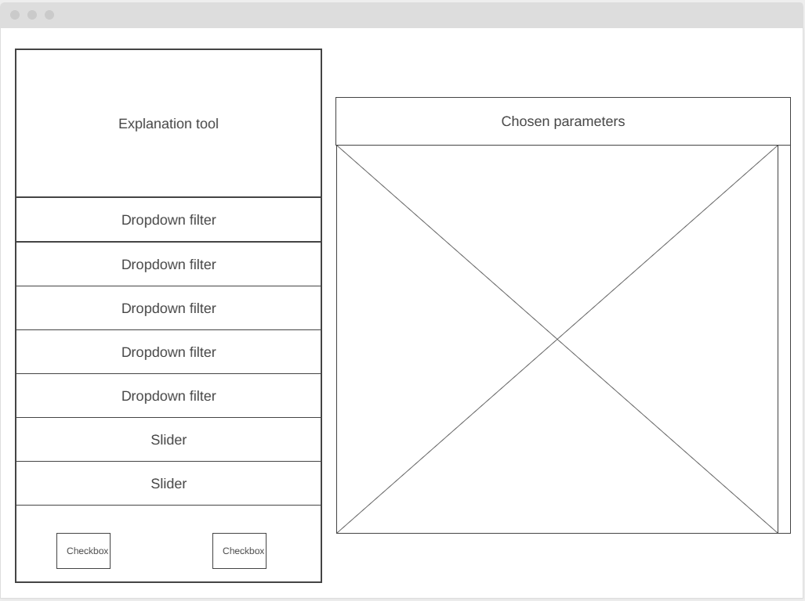

```{r}
library(shiny)
library(ggplot2)
library(tidyr)
library(plotly)
library(naniar)
```

# Tools

|**Tool**       |**Version** |**Purpose**                               |**License**
|------------|----------------------|--------------------------------------------|-----------------
|[shiny]()||
|[ggplot2]()||
|[tidyr]()||
|[plotly]()||
|[naniar]()||


# Data Exploration

## Importing data

**19-11-2024**

In order to analyse the data, I first have to import the needed data files. The two data files I will download are:

**Model.csv**
- Contains metadata describing all cancer models which are referenced within the DepMap portal, but in this case specifically 'OmicsExpressionProteinCodingGenesTPMLogp1.csv'. The metadata is very extensive and descriptions of each of the metadata columns can be found in the table below. The descriptions are copied from the documentation of the DepMap database.

| Column name | Description|
|-------------|------------|
| **ModelID** | Unique identifier for the model |
| **PatientID** | Unique identifier for models derived from the same tissue sample |
| **CellLineName** | Commonly used cell line name |
| **StrippedCellLineName** | Commonly used cell line name without characters or spaces |
| **DepmapModelType** | Abbreviated ID for model type. For cancer models, this field is from Oncotree, information for other disease types are generated by DepMap |
| **OncotreeLineage** | Lineage of model. For cancer models, this field is from Oncotree, information for other disease types are generated by DepMap |
| **OncotreePrimaryDisease** | Primary disease of model. For cancer models, this field is from Oncotree, information for other disease types are generated by DepMap |
| **OncotreeSubtype** | Subtype of model. For cancer models, this field is from Oncotree, information for other disease types are generated by DepMap |
| **OncotreeCode** | For cancer models, this field is based on Oncotree. For some models for which no corresponding code exists, this field is left blank |
| **LegacyMolecularSubtype** | Additional information about model molecular features |
| **LegacySubSubtype** | Additional information about model subtype |
| **PatientMolecularSubtype** | Aggregates information known about the patient tumor |
| **RRID** | Cellosaurus ID |
| **Age** | Age at time of sampling |
| **AgeCategory** | Age category at time of sampling (Adult, Pediatric, Fetus, Unknown) |
| **Sex** | Sex at time of sampling (Female, Male, Unknown) |
| **PatientRace** | Patient/clinical indicated race (not derived) |
| **PrimaryOrMetastasis** | Site of the primary tumor where cancer originated from (Primary, Metastatic, Recurrance, Other, Unknown) |
| **SampleCollectionSite** | Site of tissue sample collection|
| **SourceType** | Indicates where model was onboarded from (Commerical, Academic lab, Other) |
| **SourceDetail** | Details on where model was onboarded from |
| **CatalogNumber** | Catalog number of cell model, if commercial |
| **PatientTreatmentStatus** | Indicates if sample was collected before, during, or after the patient's cancer treatment (Pre-treatment, Active treatment, Post-treatment, Unknown) |
| **PatientTreatmentType** | Type of treatment patient received prior to, or at the time of, sampling (e.g. chemotherapy, immunotherapy, etc.), if known |
| **PatientTreatmentDetails: Details about patient treatment** |
| **Stage** | Stage of patient tumor |
| **StagingSystem** | Classification system used to categorize disease stage (e.g. AJCC Pathologic Stage), if known |
| **PatientTumorGrade** | Grade (or other marker of proliferation) of the patient tumor, if known |
| **PatientTreatmentResponse** | Any response to treatment, if known|
| **GrowthPattern** | Format model onboarded in (Adherent, Suspension, Organoid, Neurosphere, Neurosphere 2D, Unknown) |
| **OnboardedMedia** | Description of onboarding media |
| **FormulationID** | The unique identifier of the onboarding media |
| **PlateCoating** | Coating on plate model onboarded in (Laminin, Matrigel, Collagen, None) |
| **EngineeredModel** | Indicates if model was engineered (genetic knockout, genetic knock down, cultured to resistance, other) |
| **TissueOrigin** | Indicates tissue model was derived from (Human, Mouse, Other) |
| **ModelDerivationMaterial** | Indicates what material a model was derived from (Fresh tissue, PDX, Other) |
| **PublicComments** | Comments released to portals |
| **CCLEName** | CCLE name for the cell line |
| **HCMIID** | Identifier models available through the Human Cancer Models Initiative (HCMI) |
| **WTSIMasterCellID** | WTSI ID |
| **SangerModelID** | Sanger ID |
| **COSMICID** | Cosmic ID |
| **DateSharedIndbGaP** | Date data became available in dbGaP|


**OmicsExpressionProteinCodingGenesTPMLogp1.csv**

- Contains the gene expression transcripts per million (TPM) values of the protein coding genes for DepMap cell lines as described in `model.csv`. TPM is a way of normalization of transcript counts data in measuring gene expression levels. Normalization is necessary, because the number of reads will differ per cell line during the RNA sequencing step. TPM measures the amount of mapped reads per million mapped reads, which results in a display of ratio in mapped reads instead of an absolute number, thus normalizing the data. Figure 1 displays the corresponding formula that belongs to normalization using TPM [@Zhao2020].

- Gene expression values are obtained through RNA-sequencing, using RSEM, which is a transcript counting tool. Specifically `unstranded mode` was used. Finally a log2 transformation was performed, which scales the data acoording to a log2 scale, reducing distance between values, and escpecially outliers. In this a pseudo-count of 1 was used, which results in the following formula: log2(TPM+1). The plus 1 as pseudo counts results in there being no negative values in the final data.


In the following two code blocks I read in both .csv-files and save them as variables. I use read.csv to do so, because of the corresponding file type.
```{r}
#model <- read.csv("/homes/ytimmer2/kwartaal6/applicatie/data/Model.csv")
#model <- read.csv("C:\\Users\\yamil\\OneDrive - Hanze\\Bio-informatica\\Jaar 2\\2.1 applicatie\\goede_git\\Model.csv", na.strings = "")

model <- read.csv("C:\\Users\\yamil\\OneDrive - Hanzehogeschool Groningen\\Bio-informatica\\Jaar 2\\2.1 applicatie\\goede_git\\Model.csv", na.strings = "")
```

```{r}
#expression_db <- read.csv("C:\\Users\\yamil\\OneDrive - Hanze\\Bio-informatica\\Jaar 2\\2.1 applicatie\\goede_git\\OmicsExpressionProteinCodingGenesTPMLogp1.csv")

expression_db <- read.csv("C:\\Users\\yamil\\OneDrive - Hanzehogeschool Groningen\\Bio-informatica\\Jaar 2\\2.1 applicatie\\goede_git\\OmicsExpressionProteinCodingGenesTPMLogp1.csv")
```

## Merging the datasets

**19-11-2024**

Next I will merge the datasets on a corresponding factor. `Model.csv` contains the general info about the tumor cell lines, such as age and sex of the patient and the specific type of cancer the cell line is derived from. `OmicsExpressionProteinCodingGenesTPMLogp1.csv` contains these same models, however not all of them. As seen by running the code block below, model has 1959 rows and expression_db has 1517 rows. Thus an extra step is needed to merge the columns from these tables. As we cannot just merge columns of 1517 rows to columns of 1959 rows, as they will not be aligned. 

```{r}
model_length <- length(rownames(model))
expression_db_length <- length(rownames(expression_db))

```

However `model` and `expression_db` both contain a column with a value that serves as indentification ID. `model` has a column `ModelID` and `expression_db` has a column `X`. Both contain the same identification number that is used to identify the cell line. So if I match the rows of both `model` and `expression_db` I can merge the columns of both tables. Using the merge()-function in base R, I give both tables and the columns on which they should be matched on and thereafter merged. `all = FALSE` tells the function to only keep the rows in which a match and merge has taken place, meaning that any of the rows from `model` or `expression_db` without a matching ID, will be removed. The rows that will be removed will only be rows from `model`, as not all cell lines from model have been used in expression_db. 

```{r}
merged <- merge(model, expression_db, by.x = "ModelID", by.y = "X", all = FALSE)
```

To check whether the merging is succesful I check whether the number of rows in merged dataframe is equal to the number of rows in expression_db.

```{r}
merged_length <- length(rownames(merged))

merged_length == expression_db_length
```

## Converting data

**19-11-2024**

In the merged dataframe, the columnnames, from index 44-end, represent the gene names. The columns itself show the expression levels per gene. However the columnnames as of now don't lend themselves for an easy user-experience, due to the names being confusing. Example: '*TSPAN6..7105.*', instead of just 'TSPAN6'. All of the gene names follow a similar pattern to '..numbers.', with a regex statement this pattern can easily be removed, which results in more 'clean' names for all the genes. 

I use the regex statement "`\\.\\.[0-9]+\\.", '\\.`' stands for a singular '.' in the pattern, the backslashes are needed because '.' can also be interpreted as 'any symbol'. [0-9] indicates any number from 0-9 and the '+' indicates that at least 1 number is expected, but that it will still be recognized even if there is 2 or more numbers in a row. Using the sub()-function I substitute this regex statement with "", meaning it will fully be removed. Resulting in column names with cleaner versions of the gene names.

```{r}
# converts gene names of columns to simplified, cleaner version using regex statement
for ( col in 44:ncol(merged)){
    colnames(merged)[col] <-  sub("\\.\\.[0-9]+\\.", "", colnames(merged)[col])
}
```

## Making the data tidy

**26-11-2024**
The merged data (consisting of the metadata and the expression data) is not 'clean' data. Meaning it does not meet the Tidy requirements. The merged data contains a seperate column for each gene and within each column it has the expression levels per row (meaning per tumor cell line). However the preferred, or Tidy way, is to have one column per variable, meaning that all gene columns should be combined into one 'gene' column and all expression columns should be combined into one 'expression' column. This can be achieved using the tidyr function `pivot_longer()`. The gene columns are selected by giving a vector which contains the column names. The index 44:ncol(merged) selects all columns starting from column 44, which is where the gene columns start. The gene columns are converted to one gene column, named '*gene*' and all expression values are converted to a seperate column, named '*expression*'.

```{r}
tidy_merged <- merged %>% pivot_longer(cols = c(names(merged[44:ncol(merged)])),
                    names_to = 'gene',
                    values_to = 'expression') 
```


## Visualising missing data

**27-11-2024**

The figure below is generated using the naniar package, which offers tools to visualise missing data. It can easily be told from the figure below that (almost) all values are missing in the `TissueOrigin`, `StagingSystem`, `PatientTumorGrade` and `DataSharedIndbGaP` columns. Even though the figure displays the amount of missing values as 100%, it cannot be certainly said that ALL values are missing, because of the size of the dataframe, so even if some rows do have these values, it will not show up in the figure. `WTSIMasterCellID` and `COSMICID` seem to have missing values in around half of the rows (a bit over 50%). And `Age` seems to be missing values in approximately 18.75% of the rows. All other variables seem to have a very low number of missing values, which makes these variables a good option as metadata to use for filtering in the application by the user. However it seems there are a lot more missing values, given as "", instead of 'NA'. These need to be converted properly, so I have added '`na.strings=""`' to the read.csv statement for model.csv. Now it seems clear that the amount of missing data is a lot larger than I first thought, as can be seen in figure. Other, not yet named columns that also seem to be missing (almost) all data are: `PatientTreatmentType`, `PatientTreatmentDetails`,`ModelDerivationMaterial`, `HCMIID`, `PatientTreatmentResponse`, `Stage`, `EngineeredModel`, `PatientTreatmentStatus`, `PublicComments`, `PatientMolecularSubtype`, `LegacyMolecularSubtype`. The following columns seem to be missing around 25-60% of the data: `PatientRace`, `LegacySubSubtype`, `SangerModelID`, `CatalogNumber`. Based on this data it will have to be carefully evaluated which metadata columns are suitable for allowing the user to filter the data.

```{r}
gg_miss_var(tidy_merged, show_pct = TRUE) + labs(y = "Missing values (%)")
```

# Visualization
## Barplot

**20-11-2024**

A simple, yet efficient way of visualising expression values and cell lines can be done using a barplot. For this I am using the ggplot library, with the geom_bar function. For the data I give the merged dataframe, with the gene (in this case, TSPAN6) as x-axis and the tumor cell line name as y-axis. This results in expression levels being shown horizontally (x-axis) and corresponding cell line names vertically (y-axis). I ordered the expression levels from high to low, seeing as in cancer therapy one might be looking for highly overexpressed genes, in order to develop a treatment that could interfere on the expression of that gene. I sorted them using the reorder()-function, by first giving the `StrippedCellLineName` column, and then telling it to sort it based off of the expression values in the gene (TSPAN6). 

However one might also be interested in genes with a very low expression, because this gene could also possibly be involved in the development of cancer in that cell line. The gene can for example be a tumor suppressor gene, which can also possibly be treated if a medication would be developed that could increase the expression of that gene again. I am planning on allowing the user to sort from either high-low or low-high for gene expression levels in the application. Sorting from low-high can be done by adding a '-' in the following line: `y=reorder(StrippedCellLineName,-TSPAN6)`. The code below is just a first visualisation, later I will add onto the code and write it as a function so it can easily be used with different parameters, which will be needed for the application.

```{r}
# generates horizontal barplot of chosen gene and cell lines that express this gene 
gene_expr_cell_line <- ggplot(data=head(merged), aes(x=TSPAN6,
                                                     y=reorder
                                                     (StrippedCellLineName,TSPAN6)))+ geom_bar(stat="identity", fill = 'blue') + ylab("Tumor Cell Line") + xlab("Expression level (log2 TPM)") + labs(subtitle = "TSPAN6") + theme_minimal()

gene_expr_cell_line

```

As of now I am only using the head of the data, as there are a lot of tumor cell lines (1517), by using various filtering methods I would like to lower this amount, for example let the user filter between specific expression levels, or only include cell lines extracted from certain types of tumors, so that the application won't have to display such an extensive barplot.


**21-11-2024**

```{r}
# generates horizontal barplot of chosen gene and cell lines that express this gene 
cell_line_barplot <- function(dataset, aes.x, aes.y) {
  return(ggplot(data=dataset, aes(x= aes.x, y= aes.y)) +
           geom_bar(stat="identity", fill = 'blue') + ylab("Tumor Cell Line") + xlab("Expression level (log2 TPM)") +
           theme_minimal())
}
```

To further filter on specific traits like age category, sex or race, simple statements like this can be used:
```{r}
filtered <- subset(tidy_merged, StrippedCellLineName %in% c('U2OS', 'RD'), gene %in% c('TSPAN6', 'TNMD', 'DPM1'))
```

The new cell_line_barplot function can now be called as shown in the code below:
```{r}
# Generates barplot with cell_line_barplot function, using user given parameters
cell_line_barplot(dataset = filtered, aes.x = filtered$TSPAN6, aes.y = reorder(filtered$StrippedCellLineName, filtered$TSPAN6))
```

## Boxplot
expressie van 1 celline

```{r}
# Generates barplot with cell_line_barplot function, using user given parameters
cell_line_boxplot <- ggplot(head(tidy_merged), 
                            aes(x = StrippedCellLineName, y = expression)) +
  geom_boxplot() +
  labs(x = "TSPAN6 Expression", y = "Cell Line Name") 
cell_line_boxplot
```


## Other ways of visualising the expression data

**03-12-2024**

Another way to visualise the expression data, would be to let the user choose one cell line, and by using that show the expression in chosen genes. This is opposite of the visualisations shown before, where the user chooses a gene and it displays the cell lines. First the dataset needs to be filtered on one specific cell line (which will be chosen by the user in the application). 

```{r}
filtered <- subset(tidy_merged, StrippedCellLineName == "NIHOVCAR3")

```

Next it can be visualised using the code below, which is very similar to the previous plot that I made for the visualisation of the expression per gene in each cell line. 
```{r}
cell_line_gene_expr <- ggplot(data=head(tidy_merged), aes(x=gene,
                                                     y=expression))+ geom_bar(stat="identity", fill = 'blue') + coord_flip() + xlab("Gene") + ylab("Expression level (log2 TPM)") + labs(subtitle = "NIHOVCAR3") + theme_minimal()

cell_line_gene_expr

```
# Developing the application


## Thinking about what should be in the application

**21-11-2024**

There is a lot of metadata available for these datasets. In the chapter 'Importing data', all metadata variables can be seen, with a short explanation on what exactly they are. It is important to beforehand realize what metadata is important to include in the application, which is what I will do today. In the table below all variables that I have chosen are shown. I will further discuss these with the teachers whether this is a good selection.

| Variable               | Options                                                                                                                       | Description                                                                                                                                                                               |
|------------------------|-------------------------------------------------------------------------------------------------------------------------------|-------------------------------------------------------------------------------------------------------------------------------------------------------------------------------------------|
| Gene                   | 19192 different genes                                                                                                         | Allows the user to filter on gene, which allows visualisation of the expression per cell line of the chosen gene.                                                                         |
| Age category           | adult, pediatric, fetus, unknown                                                                                              | Allows the user to filter on age category, which is useful in research in cancer types in specific life stages.                                                                           |
| Sex                    | female, male, unknown                                                                                                         | Allows the user to filter on sex, which is useful if they are interested in cancer cell lines in specifically females or males.                                                           |
| Race                   | caucasian, asian, african, east_indian, north_african, black_or_african_american, american_indian_or_native_american, unknown | Allows the user to filter on race, which is useful if they are interested in cancer cell lines in specific races.                                                                         |
| OncotreeLineage        | various cancer families, e.g.: lung, kidney, breast, skin                                                                     | This is the cancer 'family', also known as the lineage. Including this filter will allow the user to search within specific fields for cancer, which allows for more generalized results. |
| OncotreePrimaryDisease | various cancer types, e.g.: melanoma, embryonal tumor, retinoblastoma, hepatoblastoma                                         | This is the actual cancer type of the model. Including this filter allows the user to very specifically search for certain types of cancer.                                               |

All of these variables had a very low amount to no missing values, as can be seen at the '*Visualising missing data*' chapter.


## Developing a wireframe

**21-11-2024**

Before starting on making the application, it is good to think of a general design first. Today I will do this using a [wireframe builder website](https://wireframe.cc/). My idea for the application design is to have all the user parameters on the left side and have a display for the generated figure on the right side. The left side first consists of a short explanation for usage of the tool and background information on what the tool does. The dropdown filters are objects where the user can choose a specific filter on a specific variable, e.g. selecting "Adult" for the filter "Age Category". For the slider objects, the user can give a certain value for certain variables, such as 'minimum expression levels' or 'number of cell lines displayed'. I want to make the graph scrollable, if possible, for when a user wants to view a large number of cell lines for the chosen gene. However I will have to look into whether a limit should be set for this, as to not make the application lag too much. At the bottom of the left side there are two checkbox objects. Here the user can check/uncheck certain filters, such as 'display cell lines where expression = 0'. Above the generated figure, the chosen parameters will be updated and displayed each time a new figure is generated.


The variables I want to include in the application have been discussed in the former subchapter. 


**02-12-2024**
Today I have decided to add a second tab to the application, in which the filtered data is showcased in a table. So the user can easily view the values of the data, instead of only being able to read them from a graph. For this tab I have made another wireframe (see figure):


**21-11-2024**

I have started trying to develop the application using the documentation for Shiny and using the online version of the book ('Mastering Shiny')[https://mastering-shiny.org/index.html] by Hadley Wickham. This is by no means the final version of the application, I will be using the wireframe I have made to start a rough sketch of the application and will finetune it later, by asking for feedback. 

For today I just focused on making a basic layout, according to the wireframe. First I will be adding the code for a basic ui layout, as following:

```
ui <- fluidPage(
  titlePanel(),
  sidebarLayout(
    sidebarPanel(),
    mainPanel()
  )
)
```
Next I add the actual elements that the user can interact with, which are `selectInput` objects. I do this for each of the parameters that I want the user to be able to change. Below is an example for the selectInput for the cancer type. By adding selected = TRUE, the aplpication will automatically select the option that is at the top of the list. By adding the sort()-function, the choices will be displayed in alphabetical order from A-Z.

```{r}
selectInput("onco_type", label = "Select type of cancer", selected = TRUE, choices =
                    sort(merged$OncotreePrimaryDisease))
```

I also add a `submit-button`, so that when I add the plot, the application won't try to constantly refresh the plot every time the user selects an option, because there is 5 different parameters which means that if the user wants to change those 5 parameters to generate 1 plot, the application will refresh the plot 5 times in the meantime. By adding the submit button the user can decide when they want to refresh and show a plot with the newly adjusted parameters.

```{r}
submitButton(text = "Apply settings")
```

**22-11-2024**

**24-11-2024**
The current 'selectInputs' with the dropdown menus for all parameters offered so far (gene_name, onco_type, sex, race, and age_category) all offer a lot of choices, with gene nemes for example being over 19000 options. When running the application I would get warnings on each of these selectInputs having too many options and this was noticeable by the long time the app took to launch every time. Today I looked into the problem and I discovered a better alternative to the selectInputs function, which is the 'selectizeInput' function. `selectizeInput` can be used in 2 different ways. 

The first way is to just replace all the selectInputs in the ui, however this will not solve the problem of the application being slow, as this uses the client-side selectize input. The client-side selectize input uses JavaScript to process the searching as the user is typing in an option. So for example when a user starts typing 'Fe' in the sex input, the application will show 'Female' as an option. It works the same with other inputs with more choices, such as the gene_name. 

The second way to use `selectizeInput`, is to add it to the ui and update it through the server, this is the `server-side selectize input`. The server-side selectize input uses R to process the searching, which (when updated) returns the filtered data to selectize. The latter option is way more efficient and thus a good option for solving the problem I have with the application launching and updating too slow.

I have updated all my `selectInput` functions to `selectizeInput` and have added a selectizeInput updating function to the server, which updates all of the selectizeInputs from the ui.

**26-11-2024**
Today I have adjusted the ggplot code, to make the expression values be displayed from high to low in the plot. In order to do this I need to use the reorder() function, which takes 2 arguments, the object that needs to be reordered and an object based on which the reordering will take place. The object that needs to be reordered is the StrippedCellLineName, which is the column with all the cancer cell line names. These need to be reordered based on the expression values of the corresponding rows of the chosen gene. These values are acquired by using `input$gene_name`, which contains the input of the gene_name dropdown menu in the application. `input$gene_name` returns the chosen gene name as a string, hence why `!!sym()` will have to be used to convert the string to a symbol, so the corresponding column can be found in the given data (filtered).

The full aes will then be as following:

```{r}
ggplot(
  data = filtered, aes(x = !!sym(input$gene_name), y = reorder(StrippedCellLineName,
                                                              !!sym(input$gene_name))))
```

```{r}
generate_table <- function(data, input){
    tidy_merged %>% select(matches("StrippedCellLineName"), matches("gene"),
                           matches("expression"))
    
  }

```

```{r}
tidy_merged %>% select(matches("StrippedCellLineName"), matches("gene"), matches("expression"))
```

```{r}
base <- ggplot(mpg2, aes(displ, hwy)) + 
  geom_blank() + 
  xlab(NULL) + 
  ylab(NULL)

base + facet_wrap(~class, ncol = 3)
base + facet_wrap(~class, ncol = 3, as.table = FALSE)

```

```{r}
filtered <- tidy_merged %>% filter(OncotreePrimaryDisease == "Ovarian Epithelial Tumor" 
                                   & Sex == "Female"
                                   & gene == "A1BG" | gene == "TSPAN6" )
```

facet_wrap to compare multiple genes, will probably be maximum of 10 in the application
```{r}
ggplot(head(filtered), aes(CellLineName, expression)) +
  geom_bar(stat = "identity", fill = 'blue') +
  geom_blank() + facet_wrap(~ gene)
```


data in commons zetten (tidy en ruw)
altijd kijken of wel klopt (bijv. bij merge)
inline code gebruiken bijv number of rows is `r length(table)` en ook daadwerkelijk zeggen dat het klopt na het checken
dyplyr::mutate(across(), functie) voor regex
kolom identifier
44:ncol(merged) bij kolomnamen
terugkomen op barplor (is dit wat ik verwacht etc)
code netter organiseren
meer exploratie
code reindent lines
selectize input renamen en naar functions verplaatsen

filter function(input, sex, age, race)
print(filtering) om te checken of filter pas runt als er op submit wordt geklikt
r oxygen format voor functie documentatie
bestand opslaan als .r data (met functie: save(data, file = bla.Rdata)) en dan load(bla.Rdata)
unittests voor een aantal van de functies (bijv. voor filter)
exploratie knitten als html en in repo
readme, gebruikershandleiding
niks op x as, expressie op y-as en dan groupen op iets voor facet wrap
boxplot rechtop
heatmap met gen op yas celline xas kleur expressie en dan selecteren op kankersoort en daarna verder filteren

